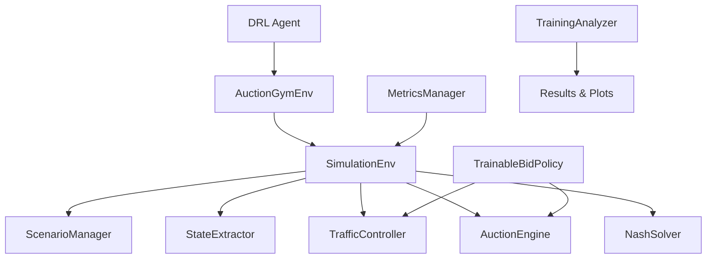

# 无信号灯交叉口控制系统技术文档 (Unsignalized Intersection Control System Technical Documentation)

## 项目概述 (Project Overview)

本项目是一个基于CARLA仿真环境的无信号灯交叉口智能交通控制系统，采用分布式拍卖机制、纳什均衡理论和深度强化学习技术，实现车辆和车队的协调通行。系统支持单车和车队混合模式，通过多层次的决策机制确保交通效率和安全性。

This project is an intelligent traffic control system for unsignalized intersections based on the CARLA simulation environment. It employs decentralized auction mechanisms, Nash equilibrium theory, and deep reinforcement learning to coordinate vehicle and platoon traffic flow. The system supports mixed vehicle-platoon modes and ensures traffic efficiency and safety through multi-level decision-making mechanisms.

### 核心特性 (Core Features)

- **分布式拍卖系统**: 基于出价机制的车辆优先级协调
- **纳什均衡求解**: 博弈论方法解决交通冲突和死锁
- **深度强化学习**: 可训练的参数优化和策略学习
- **车队管理**: 智能车辆编队形成和协调控制
- **实时监控**: 全面的性能指标和统计分析
- **模块化设计**: 松耦合架构支持灵活扩展

### 技术栈 (Technology Stack)

- **仿真环境**: CARLA 0.9.11
- **编程语言**: Python 3.7+
- **强化学习**: Stable-Baselines3 (PPO)
- **数学优化**: NumPy, SciPy
- **可视化**: Matplotlib, Seaborn
- **配置管理**: YAML, JSON

## 系统架构 (System Architecture)

### 整体架构图 (Overall Architecture)

```
┌─────────────────────────────────────────────────────────────────┐
│                    无信号灯交叉口控制系统                          │
│                Unsignalized Intersection Control System         │
└─────────────────────────────────────────────────────────────────┘
                                │
                ┌───────────────┼───────────────┐
                │               │               │
        ┌───────▼───────┐ ┌─────▼─────┐ ┌──────▼──────┐
        │   环境层        │ │  控制层    │ │   决策层     │
        │ Environment   │ │ Control   │ │ Decision   │
        │ Layer         │ │ Layer     │ │ Layer      │
        └───────┬───────┘ └─────┬─────┘ └──────┬──────┘
                │               │               │
        ┌───────▼───────┐ ┌─────▼─────┐ ┌──────▼──────┐
        │ CARLA仿真     │ │ 交通控制   │ │ 拍卖引擎    │
        │ 场景管理      │ │ 车辆执行   │ │ 纳什求解    │
        │ 状态提取      │ │ 车队管理   │ │ DRL训练     │
        └───────────────┘ └───────────┘ └─────────────┘
```

### 四层时间层次设计 (Four-Level Time Hierarchy)

系统采用固定的四层时间层次，确保各组件间的完美同步：

```
Level 1: 仿真步长 (0.1s)
  ├── 物理更新和车辆移动
  └── 基础仿真循环

Level 2: 决策步长 (1.0s) 
  ├── 车辆行为决策
  ├── 路线规划
  └── 10个仿真步长/决策

Level 3: 拍卖周期 (4.0s)
  ├── 出价阶段 (2.0s)
  ├── 执行阶段 (2.0s)
  └── 4个决策步长/拍卖周期

Level 4: 系统检查 (8.0s)
  ├── 死锁检测
  ├── 性能监控
  └── 2个拍卖周期/系统检查
```

## 项目结构 (Project Structure)

```
Unisignalized-Intersection-Control/
├── agents/                    # 智能体导航模块
│   ├── navigation/           # 导航算法实现
│   │   ├── agent.py         # 基础智能体类
│   │   ├── behavior_agent.py # 行为智能体
│   │   ├── basic_agent.py   # 基础导航智能体
│   │   ├── roaming_agent.py # 漫游智能体
│   │   ├── controller.py    # 车辆控制器
│   │   ├── global_route_planner.py      # 全局路径规划器
│   │   ├── global_route_planner_dao.py  # 路径规划数据访问
│   │   ├── local_planner.py # 局部路径规划器
│   │   ├── local_planner_behavior.py    # 行为局部规划器
│   │   └── types_behavior.py # 行为类型定义
│   └── tools/               # 工具函数
│       └── misc.py          # 杂项工具
├── auction/                 # 拍卖系统模块
│   ├── auction_engine.py   # 分布式拍卖引擎
│   ├── bid_policy.py       # 出价策略
│   └── core/               # 核心组件
│       └── __init__.py
├── config/                 # 配置管理模块
│   └── unified_config.py   # 统一配置管理
├── drl/                    # 深度强化学习模块
│   ├── agents/             # 训练算法
│   │   └── ppo_trainer.py  # PPO训练器
│   ├── configs/            # 配置文件
│   │   └── ppo_config.yaml # PPO配置
│   ├── envs/               # 环境实现
│   │   ├── auction_gym.py  # 拍卖Gym环境
│   │   ├── metrics_manager.py # 指标管理器
│   │   └── sim_wrapper.py  # 仿真包装器
│   ├── policies/           # 可训练策略
│   │   └── bid_policy.py   # 出价策略
│   ├── utils/              # 工具函数
│   │   ├── analysis.py     # 分析工具
│   │   └── plot_generator.py # 图表生成器
│   ├── past_train/         # 历史训练结果
│   └── train.py            # 主训练脚本
├── env/                    # 环境模块
│   ├── carla_wrapper.py    # CARLA包装器
│   ├── scenario_manager.py # 场景管理器
│   ├── simulation_config.py # 仿真配置
│   ├── state_extractor.py  # 状态提取器
│   └── traffic_generator.py # 交通生成器
├── nash/                   # 纳什均衡模块
│   ├── conflict_analyzer.py # 冲突分析器
│   ├── deadlock_detector.py # 死锁检测器
│   ├── deadlock_nash_solver.py # 死锁纳什求解器
│   └── mwis_solver.py      # 最大权重独立集求解器
├── platooning/             # 车队管理模块
│   ├── platoon_manager.py  # 车队管理器
│   └── platoon_policy.py   # 车队策略
├── carla_l/                # Linux CARLA库
├── carla_w/                # Windows CARLA库
├── intersection_screenshots/ # 交叉口截图
├── logs/                   # 日志文件
├── main.py                 # 主程序入口
├── control.py              # 交通控制器
├── intersection_analyzer.py # 交叉口分析器
├── traffic_light_override.py # 交通灯覆盖
├── run_drl_training.py     # DRL训练启动脚本
└── requirements_drl.txt    # DRL依赖包
```

## 关键模块职责 (Key Module Responsibilities)

### 1. 环境层 (Environment Layer)

#### ScenarioManager (场景管理器)
- **职责**: 管理CARLA仿真场景的创建、初始化和生命周期
- **主要功能**:
  - 初始化CARLA客户端和世界
  - 管理仿真时间统计
  - 提供俯瞰视角设置
  - 处理场景重置和清理

#### StateExtractor (状态提取器)
- **职责**: 从CARLA仿真中提取车辆状态和交通信息
- **主要功能**:
  - 获取车辆位置、速度、方向等状态
  - 计算车辆到交叉口的距离
  - 提供路径规划和导航信息
  - 缓存机制优化性能

#### TrafficGenerator (交通生成器)
- **职责**: 生成和管理仿真中的车辆
- **主要功能**:
  - 在指定位置生成车辆
  - 管理车辆生命周期
  - 碰撞检测和统计
  - 车辆标签显示

### 2. 控制层 (Control Layer)

#### TrafficController (交通控制器)
- **职责**: 基于拍卖结果执行车辆控制指令
- **主要功能**:
  - 应用GO/WAIT控制策略
  - 管理车辆速度差异和跟车距离
  - 处理车队协调控制
  - 统计控制效果和性能指标

#### PlatoonManager (车队管理器)
- **职责**: 管理车辆编队的形成、维护和解散
- **主要功能**:
  - 检测相邻车辆并形成车队
  - 维护车队内部协调
  - 计算车队性能指标
  - 处理车队解散逻辑

### 3. 决策层 (Decision Layer)

#### DecentralizedAuctionEngine (分布式拍卖引擎)
- **职责**: 实现基于拍卖的车辆优先级协调机制
- **主要功能**:
  - 识别参与拍卖的车辆和车队
  - 收集和处理出价信息
  - 执行拍卖评估和排序
  - 集成纳什均衡求解器

#### DeadlockNashSolver (死锁纳什求解器)
- **职责**: 使用博弈论方法解决交通冲突和死锁
- **主要功能**:
  - 分析车辆间的空间和时间冲突
  - 构建冲突图并求解最大权重独立集
  - 检测和预防交通死锁
  - 提供冲突解决决策

#### TrainableBidPolicy (可训练出价策略)
- **职责**: 通过DRL优化出价策略参数
- **主要功能**:
  - 计算车辆和车队的出价值
  - 支持DRL参数训练和优化
  - 提供增强的控制参数
  - 记录出价历史用于分析

### 4. 配置管理 (Configuration Management)

#### UnifiedConfig (统一配置管理)
- **职责**: 集中管理所有系统组件的配置参数
- **主要功能**:
  - 系统级配置（地图、CARLA设置等）
  - 冲突检测参数
  - MWIS求解器参数
  - 死锁检测参数
  - DRL训练参数

## 系统集成与工作流程 (System Integration and Workflow)

### 主循环工作流程 (Main Loop Workflow)

```python
# 1. 系统初始化
scenario = ScenarioManager()
state_extractor = StateExtractor(scenario.carla)
platoon_manager = PlatoonManager(state_extractor)
auction_engine = DecentralizedAuctionEngine(state_extractor)
nash_solver = DeadlockNashSolver(unified_config)
traffic_controller = TrafficController(scenario.carla, state_extractor)

# 2. 主仿真循环
while True:
    scenario.carla.world.tick()
    vehicle_states = state_extractor.get_vehicle_states()
    
    if step % logic_update_interval == 0:
        # 2.1 更新车队分组
        platoon_manager.update()
        
        # 2.2 执行拍卖系统
        auction_winners = auction_engine.update(vehicle_states, platoon_manager)
        
        # 2.3 应用交通控制
        traffic_controller.update_control(platoon_manager, auction_engine, auction_winners)
```

### 数据流图 (Data Flow Diagram)

```
车辆状态 → 状态提取器 → 车队管理器 → 拍卖引擎 → 纳什求解器 → 交通控制器 → CARLA车辆
    ↑                                                                    ↓
    └─────────────────── 性能监控 ← 指标管理器 ← 统计分析 ← 控制结果 ──────┘
```

### 模块间接口 (Inter-Module Interfaces)

1. **StateExtractor ↔ 所有模块**: 提供统一的车辆状态接口
2. **PlatoonManager ↔ AuctionEngine**: 车队信息传递给拍卖系统
3. **AuctionEngine ↔ NashSolver**: 拍卖获胜者传递给冲突求解器
4. **NashSolver ↔ TrafficController**: 冲突解决结果传递给控制器
5. **UnifiedConfig ↔ 所有模块**: 提供统一的配置管理接口

## 配置与部署 (Configuration and Deployment)

### 环境要求 (Environment Requirements)

- **操作系统**: Linux (推荐) / Windows
- **Python版本**: 3.7+
- **CARLA版本**: 0.9.11
- **内存要求**: 8GB+ RAM
- **GPU**: 可选，用于DRL训练加速

### 配置参数 (Configuration Parameters)

#### 系统配置 (System Configuration)
```python
# 交叉口设置
intersection_center = (-188.9, -89.7, 0.0)
intersection_half_size = 40.0

# 时间层次
fixed_delta_seconds = 0.1
logic_update_interval_seconds = 1.0
auction_interval = 4.0
```

#### 拍卖配置 (Auction Configuration)
```python
# 拍卖参数
max_participants_per_auction = 4
max_go_agents = None  # 无限制
auction_interval = 1.0
```

#### DRL配置 (DRL Configuration)
```python
# 训练参数
total_timesteps = 100000
learning_rate = 1e-4
n_steps = 256
batch_size = 64
```

### 监控与调试 (Monitoring and Debugging)

#### 实时监控 (Real-time Monitoring)
- 车辆状态和位置
- 车队形成和解散
- 拍卖结果和优先级
- 控制效果统计
- 性能指标追踪

#### 日志系统 (Logging System)
- 系统运行日志
- 错误和异常记录
- 性能统计数据
- 训练过程记录

#### 可视化工具 (Visualization Tools)
- 参数趋势分析
- 安全指标图表
- 性能指标可视化
- 训练报告生成

---

# 拍卖模块技术文档 (Auction Module Technical Documentation)

## 概述 (Overview)

拍卖模块是无信号灯交叉口控制系统的核心组件，采用分布式拍卖机制来协调车辆和车队的通行优先级。该系统支持单车和车队混合模式，集成了深度强化学习(DRL)和纳什均衡理论来解决复杂的交通冲突。

The auction module is the core component of the unsignalized intersection control system, employing a decentralized auction mechanism to coordinate traffic priority for both individual vehicles and platoons. The system supports mixed vehicle-platoon modes and integrates Deep Reinforcement Learning (DRL) and Nash Equilibrium theory to resolve complex traffic conflicts.

## 系统架构 (System Architecture)

### 核心组件 (Core Components)

```
DecentralizedAuctionEngine
├── LaneGrouper              # 车道分组器
├── ParticipantIdentifier    # 参与者识别器  
├── AuctionEvaluator         # 拍卖评估器
├── AgentBidPolicy          # 出价策略
└── Integration Points      # 集成接口
    ├── Nash Controller     # 纳什均衡控制器
    ├── DRL Bid Policy     # 深度强化学习出价策略
    └── Vehicle Enforcer   # 车辆执行器
```

### 主要类结构 (Main Class Structure)

#### 1. DecentralizedAuctionEngine
- **功能**: 主拍卖引擎，管理完整的拍卖流程
- **特性**: 
  - 支持单车和车队混合参与
  - 集成纳什均衡死锁解决
  - 支持可训练的DRL出价策略
  - 防止大规模同时移动的反批处理机制

#### 2. AuctionAgent
- **功能**: 表示参与拍卖的智能体（车辆或车队）
- **属性**:
  - `id`: 智能体唯一标识
  - `type`: 类型（'vehicle' 或 'platoon'）
  - `location`: 位置坐标
  - `data`: 相关数据
  - `at_junction`: 是否在交叉口

#### 3. Bid
- **功能**: 表示拍卖中的出价
- **属性**:
  - `participant_id`: 参与者ID
  - `value`: 出价值
  - `timestamp`: 时间戳
  - `participant`: 参与者对象

#### 4. AuctionWinner
- **功能**: 表示拍卖获胜者
- **属性**:
  - `participant`: 参与者
  - `bid`: 出价
  - `rank`: 排名
  - `conflict_action`: 冲突动作（'go' 或 'wait'）

## 拍卖流程 (Auction Process)

### 1. 参与者识别 (Participant Identification)

```python
# 识别潜在参与者
agents = self.participant_identifier.identify_agents(
    vehicle_states, platoon_manager
)
```

**识别逻辑**:
- 首先识别车队参与者（如果车队管理器可用）
- 然后识别独立车辆参与者（排除已在车队中的车辆）
- 使用车道分组器获取每个车道的领头车辆
- 检查车辆是否应该参与拍卖（有目的地、非积极通过状态）

### 2. 拍卖启动 (Auction Initiation)

**反批处理机制**:
- 限制每次拍卖的最大参与者数量（默认4个）
- 防止大规模同时移动造成的交通混乱
- 优先级选择：正在通过的车辆 > 距离交叉口最近的车辆

### 3. 出价收集 (Bid Collection)

**出价策略**:
- **DRL策略**: 如果可用，使用可训练的深度强化学习策略
- **静态策略**: 回退到基于规则的静态出价策略

**单车出价计算**:
```python
base_bid = (urgency * 20 +
           position_advantage * 15 +
           speed_factor * 10 +
           junction_factor * 25 +
           wait_time_bonus * 15)
```

**车队出价计算**:
```python
platoon_bid = base_bid + platoon_bonus + coordination_bonus + efficiency_bonus
```

### 4. 拍卖评估 (Auction Evaluation)

**评估流程**:
1. **保护机制**: 正在通过的车辆获得最高优先级
2. **常规评估**: 按出价值排序（高者优先）
3. **平局处理**: 使用时间戳作为平局打破器

### 5. 冲突解决 (Conflict Resolution)

**纳什均衡集成**:
- 将拍卖获胜者转换为纳什智能体
- 应用纳什均衡理论解决死锁
- 返回冲突解决结果

## 出价策略详解 (Bidding Strategy Details)

### 静态出价策略 (Static Bidding Strategy)

#### 单车出价因子 (Vehicle Bidding Factors)

1. **紧急度 (Urgency)**
   - 基础紧急度: 10.0
   - 方向奖励: 直行(15.0) > 右转(12.0) > 左转(10.0)
   - 距离因子: 距离交叉口越近，紧急度越高

2. **位置优势 (Position Advantage)**
   - 在交叉口内: 60.0
   - 接近交叉口: 30.0 - 距离 × 0.3
   - 距离 > 50m: 5.0

3. **速度因子 (Speed Factor)**
   - 合理速度(3-10 m/s): 10.0
   - 低速(<3 m/s): 5.0
   - 高速(>10 m/s): 7.0

4. **交叉口因子 (Junction Factor)**
   - 在交叉口内: 40.0
   - 接近交叉口: 25.0 - 距离 × 0.25

5. **等待时间奖励 (Wait Time Bonus)**
   - 0-2秒: 0.0
   - 2-5秒: (等待时间-2) × 5.0
   - 5-10秒: 15.0 + (等待时间-5) × 8.0
   - >10秒: 55.0 + (等待时间-10) × 10.0

#### 车队出价因子 (Platoon Bidding Factors)

1. **车队规模奖励 (Platoon Size Bonus)**
   - 规模奖励: 车队大小 × 500.0

2. **凝聚力奖励 (Cohesion Bonus)**
   - 检查车辆间距
   - 目标间距: 8.0m
   - 最大间距: 15.0m
   - 最优间距奖励: 15.0

3. **协调奖励 (Coordination Bonus)**
   - 同方向行驶: 20.0
   - 部分协调: 5.0

4. **效率奖励 (Efficiency Bonus)**
   - 基于速度一致性
   - 速度方差越小，奖励越高

### DRL出价策略 (DRL Bidding Strategy)

**接口设计**:
```python
bid_value = self.bid_policy.calculate_bid(
    vehicle_state=agent.data,
    is_platoon_leader=False,
    platoon_size=1,
    context={}
)
```

**支持参数**:
- `vehicle_state`: 车辆状态信息
- `is_platoon_leader`: 是否为车队领头车
- `platoon_size`: 车队大小
- `context`: 上下文信息（如车队车辆列表）

## 纳什均衡集成 (Nash Equilibrium Integration)

### 转换机制 (Conversion Mechanism)

**拍卖获胜者 → 纳什智能体**:
```python
nash_agent = SimpleAgent(
    id=str(participant.id),
    position=current_pos,
    speed=speed,
    heading=heading_rad,
    intended_path=intended_path,
    bid=bid_value,
    wait_time=wait_time
)
```

### 死锁解决 (Deadlock Resolution)

1. **检测**: 识别潜在的交通死锁情况
2. **转换**: 将拍卖结果转换为纳什均衡问题
3. **求解**: 应用纳什均衡理论求解
4. **应用**: 将解决方案应用到交通控制

## 配置参数 (Configuration Parameters)

### 核心参数 (Core Parameters)

```python
# 拍卖引擎初始化参数
intersection_center = (-188.9, -89.7, 0.0)  # 交叉口中心坐标
communication_range = 50.0                   # 通信范围
max_go_agents = None                         # 最大通行车辆数（None=无限制）
max_participants_per_auction = 4             # 每次拍卖最大参与者数
auction_interval = 1.0                       # 拍卖间隔时间
```

### 出价策略参数 (Bidding Strategy Parameters)

```python
# 出价权重
urgency_weight = 20
position_weight = 15
speed_weight = 10
junction_weight = 25
wait_time_weight = 15

# 车队奖励参数
platoon_size_multiplier = 500.0
target_spacing = 8.0
max_spacing = 15.0
```

## 性能优化 (Performance Optimization)

### 1. 反批处理机制 (Anti-Batching Mechanism)
- 限制每次拍卖的参与者数量
- 防止大规模同时移动
- 基于优先级的参与者选择

### 2. 保护机制 (Protection Mechanism)
- 正在通过的车辆获得最高优先级
- 避免中断正在进行的交通流
- 自动清理已完成通过的车辆

### 3. 通信优化 (Communication Optimization)
- 模拟V2V通信延迟和丢包
- 消息队列管理
- 广播机制优化

## 集成接口 (Integration Interfaces)

### 1. 车辆执行器 (Vehicle Enforcer)
```python
self.vehicle_enforcer = vehicle_enforcer
```

### 2. 纳什控制器 (Nash Controller)
```python
self.nash_controller = nash_controller
```

### 3. DRL出价策略 (DRL Bid Policy)
```python
self.bid_policy = bid_policy
```

### 4. 状态提取器 (State Extractor)
```python
self.state_extractor = state_extractor
```

## 监控和统计 (Monitoring and Statistics)

### 拍卖统计 (Auction Statistics)
```python
stats = {
    'active_auction': bool,           # 是否有活跃拍卖
    'current_agents': int,            # 当前参与者数
    'platoon_agents': int,            # 车队参与者数
    'vehicle_agents': int,            # 单车参与者数
    'completed_auctions': int,        # 已完成拍卖数
    'protected_agents': int,          # 受保护智能体数
    'auction_status': str,            # 拍卖状态
    'max_go_agents': str,             # 最大通行车辆数
    'current_go_count': int,          # 当前通行数
    'current_wait_count': int         # 当前等待数
}
```

## 使用示例 (Usage Example)

### 基本使用 (Basic Usage)
```python
# 初始化拍卖引擎
auction_engine = DecentralizedAuctionEngine(
    intersection_center=(-188.9, -89.7, 0.0),
    max_participants_per_auction=4
)

# 设置集成组件
auction_engine.set_nash_controller(nash_controller)
auction_engine.set_bid_policy(drl_bid_policy)

# 主更新循环
winners = auction_engine.update(vehicle_states, platoon_manager)

# 获取统计信息
stats = auction_engine.get_auction_stats()
```

### 高级配置 (Advanced Configuration)
```python
# 更新配置参数
auction_engine.update_max_go_agents(8)
auction_engine.update_max_participants_per_auction(6)
auction_engine.set_auction_interval_from_config(0.5)

# 重置状态（新episode开始）
auction_engine.reset_episode_state()
```

# 车队模块技术文档 (Platooning Module Technical Documentation)

## 概述 (Overview)

车队模块是无信号灯交叉口控制系统的核心组件之一，负责车辆编队管理、协调和优化。该模块采用模块化设计，支持松耦合集成，能够与拍卖系统、纳什均衡求解器和其他交通控制组件无缝协作。

The platooning module is a core component of the unsignalized intersection control system, responsible for vehicle platoon formation, coordination, and optimization. The module adopts a modular design with loose coupling, enabling seamless integration with auction systems, Nash equilibrium solvers, and other traffic control components.

## 系统架构 (System Architecture)

### 核心组件 (Core Components)

```
PlatoonManager
├── PlatoonConfiguration    # 车队配置管理
├── Platoon                # 车队实体类
├── PlatoonMetrics         # 性能指标
└── Integration Points     # 集成接口
    ├── State Extractor    # 状态提取器
    ├── Vehicle Filter     # 车辆过滤器
    └── Direction Estimator # 方向估计器
```

### 主要类结构 (Main Class Structure)

#### 1. PlatoonManager
- **功能**: 主车队管理器，负责车队形成、维护和解散
- **特性**: 
  - 模块化设计，支持松耦合集成
  - 可配置的车队参数
  - 实时性能监控和统计
  - 支持多种车辆过滤策略

#### 2. Platoon
- **功能**: 表示单个车队实体
- **属性**:
  - `vehicles`: 车队中的车辆列表
  - `leader`: 车队领头车
  - `platoon_id`: 车队唯一标识
  - `goal_direction`: 目标行驶方向
  - `metrics_history`: 性能指标历史

#### 3. PlatoonConfiguration
- **功能**: 车队配置参数容器
- **参数**:
  - `max_platoon_size`: 最大车队规模
  - `min_platoon_size`: 最小车队规模
  - `max_following_distance`: 最大跟车距离
  - `target_following_distance`: 目标跟车距离

#### 4. PlatoonMetrics
- **功能**: 车队性能指标数据类
- **指标**:
  - `avg_speed`: 平均速度
  - `cohesion_score`: 凝聚力评分
  - `efficiency_score`: 效率评分
  - `safety_score`: 安全评分

## 车队管理流程 (Platoon Management Process)

### 1. 车辆状态获取 (Vehicle State Acquisition)

```python
# 获取车辆状态
vehicle_states = self._get_vehicle_states()
```

**获取方式**:
- 通过状态提取器接口获取
- 支持外部直接传入车辆状态
- 异常处理确保系统稳定性

### 2. 车辆过滤 (Vehicle Filtering)

```python
# 过滤符合条件的车辆
eligible_vehicles = self._filter_eligible_vehicles(vehicle_states)
```

**过滤条件**:
- 距离交叉口中心 < 120米
- 具有目的地或正在移动
- 支持自定义过滤回调函数

### 3. 现有车队更新 (Existing Platoon Update)

```python
# 更新现有车队
self._update_existing_platoons(eligible_vehicles)
```

**更新逻辑**:
- 通过车辆ID匹配更新车辆状态
- 验证车队有效性
- 自动解散无效车队

### 4. 新车队形成 (New Platoon Formation)

```python
# 尝试形成新车队
self._attempt_platoon_formation(eligible_vehicles)
```

**形成流程**:
1. 获取可用车辆（未在车队中的车辆）
2. 按车道和方向分组
3. 验证车辆兼容性
4. 创建有效车队

### 5. 车队清理 (Platoon Cleanup)

```python
# 清理无效车队
self._cleanup_invalid_platoons()
```

**清理条件**:
- 车队状态无效
- 车辆数量不足
- 更新超时

## 车队形成算法 (Platoon Formation Algorithm)

### 1. 车辆兼容性分组 (Vehicle Compatibility Grouping)

**分组策略**:
```python
# 按车道分组
lane_groups = defaultdict(list)
for vehicle in vehicles:
    lane_id = self._get_vehicle_lane_id(vehicle)
    direction = self._estimate_vehicle_direction(vehicle)
    lane_groups[lane_id].append((vehicle, direction))
```

**兼容性检查**:
- 相同车道
- 相同行驶方向
- 合理的车辆间距

### 2. 相邻车辆检测 (Adjacent Vehicle Detection)

**检测逻辑**:
```python
# 按距离排序
sorted_vehicles = sorted(
    lane_vehicles,
    key=lambda x: self._distance_to_intersection(x[0])
)
```

**相邻条件**:
- 车辆间距 ≤ 最大跟车距离
- 相同行驶方向
- 连续排列

### 3. 车队验证 (Platoon Validation)

**验证标准**:
- 最小车队规模: 2辆车
- 最大车队规模: 4辆车
- 车辆间距: 2-20米
- 所有车辆方向一致

## 方向估计机制 (Direction Estimation Mechanism)

### 1. 导航系统查询 (Navigation System Query)

```python
# 通过导航系统获取方向
direction = self._state_extractor.get_route_direction(
    vehicle_location, vehicle['destination']
)
```

**查询条件**:
- 车辆具有有效目的地
- 状态提取器可用
- 支持CARLA导航系统

### 2. 速度向量分析 (Velocity Vector Analysis)

```python
# 基于速度向量推断方向
velocity = vehicle.get('velocity', [0, 0, 0])
if abs(velocity[0]) > 0.1 or abs(velocity[1]) > 0.1:
    # 分析速度方向
    return self._analyze_velocity_direction(velocity)
```

**分析策略**:
- 检查速度向量大小
- 避免基于微小速度的误判
- 作为导航系统的补充

### 3. 方向缓存机制 (Direction Caching)

```python
# 缓存方向信息
if current_time - self._direction_cache_time > self._direction_cache_duration:
    new_direction = self._query_navigation_direction()
    if new_direction:
        self._cached_direction = new_direction
```

**缓存策略**:
- 缓存时间: 5秒
- 减少重复查询
- 提高系统性能

## 性能监控系统 (Performance Monitoring System)

### 1. 实时指标计算 (Real-Time Metrics Calculation)

**凝聚力评分 (Cohesion Score)**:
```python
def _calculate_cohesion_score(self) -> float:
    # 基于车辆间距计算凝聚力
    for dist in distances:
        if dist <= self.max_spacing:
            if self.min_spacing <= dist <= self.target_spacing * 1.5:
                score += 1.0
            else:
                score += max(0.0, 1.0 - abs(dist - self.target_spacing) / self.target_spacing)
```

**效率评分 (Efficiency Score)**:
```python
def _calculate_efficiency_score(self) -> float:
    # 基于速度一致性和移动效率
    speed_consistency = max(0.0, 1.0 - speed_variance / avg_speed)
    movement_efficiency = min(1.0, avg_speed / 10.0)
    return (speed_consistency + movement_efficiency) / 2.0
```

**安全评分 (Safety Score)**:
```python
def _calculate_safety_score(self) -> float:
    # 基于车辆间距安全性
    for i in range(len(self.vehicles) - 1):
        dist = self._vehicle_distance(self.vehicles[i], self.vehicles[i + 1])
        if dist < self.min_spacing:
            safety_violations += 1
    return 1.0 - (safety_violations / total_pairs)
```

### 2. 历史数据管理 (Historical Data Management)

**数据存储**:
```python
# 存储性能指标
self.metrics_history.append(metrics)

# 保持最近10条记录
if len(self.metrics_history) > 10:
    self.metrics_history = self.metrics_history[-10:]
```

**更新频率**:
- 指标更新间隔: 1秒
- 与系统其他组件同步
- 支持实时监控

### 3. 车队就绪状态 (Platoon Readiness Status)

**就绪条件**:
```python
def is_ready_for_intersection(self) -> bool:
    if not self.is_valid():
        return False
    
    if len(self.vehicles) > 1 and self.metrics_history:
        latest_metrics = self.metrics_history[-1]
        return (latest_metrics.cohesion_score > 0.5 and
               latest_metrics.safety_score > 0.6)
    
    return True
```

**评估标准**:
- 凝聚力评分 > 0.5
- 安全评分 > 0.6
- 车队状态有效

## 配置参数详解 (Configuration Parameters)

### 1. 车队规模参数 (Platoon Size Parameters)

```python
class PlatoonConfiguration:
    def __init__(self):
        self.max_platoon_size = 4        # 最大车队规模
        self.min_platoon_size = 2        # 最小车队规模
```

**参数说明**:
- `max_platoon_size`: 限制车队最大规模，避免过长车队影响交通
- `min_platoon_size`: 确保车队有足够车辆形成有效编队

### 2. 距离参数 (Distance Parameters)

```python
self.max_following_distance = 20.0      # 最大跟车距离
self.target_following_distance = 6.0    # 目标跟车距离
```

**参数说明**:
- `max_following_distance`: 车辆间最大允许距离
- `target_following_distance`: 理想跟车距离，用于性能评估

### 3. 系统参数 (System Parameters)

```python
self.update_interval = 1.0              # 更新间隔
self.intersection_center = (-188.9, -89.7, 0.0)  # 交叉口中心
```

**参数说明**:
- `update_interval`: 车队管理更新频率
- `intersection_center`: 交叉口中心坐标，用于距离计算

## 集成接口设计 (Integration Interface Design)

### 1. 状态提取器接口 (State Extractor Interface)

```python
def __init__(self, state_extractor=None, config: Optional[PlatoonConfiguration] = None):
    self._state_extractor = state_extractor
```

**接口功能**:
- 获取车辆状态信息
- 查询路线方向
- 支持CARLA仿真环境

### 2. 车辆过滤器接口 (Vehicle Filter Interface)

```python
def set_vehicle_filter(self, filter_callback: Callable[[List[Dict]], List[Dict]]):
    self._vehicle_filter_callback = filter_callback
```

**接口功能**:
- 自定义车辆过滤逻辑
- 支持复杂过滤条件
- 可扩展过滤策略

### 3. 方向估计器接口 (Direction Estimator Interface)

```python
# 注释掉的接口，预留扩展
# def set_direction_estimator(self, estimator_callback: Callable[[Dict], Optional[str]]):
#     self._direction_estimator_callback = estimator_callback
```

**接口功能**:
- 自定义方向估计逻辑
- 支持多种方向检测方法
- 可集成机器学习模型

## 公共API接口 (Public API Interface)

### 1. 车队查询接口 (Platoon Query Interface)

```python
def get_all_platoons(self) -> List[Platoon]:
    """获取所有有效车队"""
    return [p for p in self.platoons if p.is_valid()]

def get_platoon_by_leader_id(self, leader_id: str) -> Optional[Platoon]:
    """根据领头车ID获取车队"""
    for platoon in self.platoons:
        if platoon.leader and str(platoon.leader['id']) == str(leader_id):
            return platoon
    return None

def get_platoons_by_direction(self, direction: str) -> List[Platoon]:
    """根据方向获取车队"""
    return [p for p in self.platoons if p.get_goal_direction() == direction]
```

### 2. 统计信息接口 (Statistics Interface)

```python
def get_platoon_stats(self) -> Dict:
    """获取车队统计信息"""
    return {
        'num_platoons': len(self.platoons),
        'vehicles_in_platoons': total_vehicles,
        'avg_platoon_size': avg_size,
        'direction_distribution': dict(direction_dist),
        'performance_summary': performance_summary,
        'formation_stats': self.formation_stats
    }
```

### 3. 监控接口 (Monitoring Interface)

```python
def print_platoon_info(self):
    """打印车队信息（调试/监控用）"""
    # 显示车队状态概览
    # 显示性能指标
    # 显示方向分布
```

## 性能优化策略 (Performance Optimization Strategies)

### 1. 速率限制 (Rate Limiting)

```python
# 更新速率限制
if current_time - self.last_update_time < self.config.update_interval:
    return
```

**优化效果**:
- 减少不必要的计算
- 提高系统稳定性
- 降低CPU使用率

### 2. 缓存机制 (Caching Mechanism)

```python
# 方向信息缓存
if current_time - self._direction_cache_time > self._direction_cache_duration:
    new_direction = self._query_navigation_direction()
    if new_direction:
        self._cached_direction = new_direction
```

**优化效果**:
- 减少重复查询
- 提高响应速度
- 降低系统负载

### 3. 早期退出 (Early Exit)

```python
# 早期退出条件
if len(available_vehicles) < self.config.min_platoon_size:
    return
```

**优化效果**:
- 避免无效计算
- 提高算法效率
- 减少资源消耗

## 错误处理和容错 (Error Handling and Fault Tolerance)

### 1. 异常处理 (Exception Handling)

```python
try:
    return self._state_extractor.get_vehicle_states()
except Exception:
    return []
```

**处理策略**:
- 静默处理异常
- 返回默认值
- 确保系统稳定性

### 2. 数据验证 (Data Validation)

```python
def _validate_platoon_formation(self, vehicles: List[Dict]) -> bool:
    if len(vehicles) < 2:
        return False
    
    # 检查车辆间距
    for i in range(len(vehicles) - 1):
        distance = self._vehicle_distance(vehicles[i], vehicles[i + 1])
        if distance > self.config.max_following_distance:
            return False
        if distance < 2.0:
            return False
    
    return True
```

**验证内容**:
- 车辆数量检查
- 间距合理性验证
- 方向一致性检查

### 3. 状态恢复 (State Recovery)

```python
def _cleanup_invalid_platoons(self):
    """清理无效车队"""
    for platoon in self.platoons[:]:
        if not platoon.is_valid():
            self._dissolve_platoon(platoon, "Invalid state")
```

**恢复策略**:
- 自动清理无效状态
- 重新初始化系统
- 保持数据一致性

## 使用示例 (Usage Examples)

### 1. 基本使用 (Basic Usage)

```python
# 初始化车队管理器
platoon_manager = PlatoonManager(
    state_extractor=state_extractor,
    config=PlatoonConfiguration()
)

# 设置车辆过滤器
platoon_manager.set_vehicle_filter(custom_filter_function)

# 主更新循环
platoon_manager.update(vehicle_states)

# 获取车队信息
platoons = platoon_manager.get_all_platoons()
stats = platoon_manager.get_platoon_stats()
```

### 2. 高级配置 (Advanced Configuration)

```python
# 自定义配置
config = PlatoonConfiguration()
config.max_platoon_size = 6
config.min_platoon_size = 3
config.max_following_distance = 25.0
config.target_following_distance = 8.0

# 使用自定义配置
platoon_manager = PlatoonManager(config=config)
```

### 3. 集成示例 (Integration Example)

```python
# 与拍卖系统集成
def get_platoon_agents(platoon_manager):
    platoons = platoon_manager.get_all_platoons()
    agents = []
    
    for platoon in platoons:
        if platoon.is_ready_for_intersection():
            leader = platoon.get_leader()
            if leader:
                agent = AuctionAgent(
                    id=f"platoon_{platoon.platoon_id}",
                    type='platoon',
                    location=leader['location'],
                    data=platoon,
                    at_junction=platoon.has_vehicle_in_intersection()
                )
                agents.append(agent)
    
    return agents
```

## 扩展性设计 (Extensibility Design)

### 1. 自定义过滤策略 (Custom Filtering Strategies)

```python
def custom_vehicle_filter(vehicle_states: List[Dict]) -> List[Dict]:
    """自定义车辆过滤逻辑"""
    filtered_vehicles = []
    
    for vehicle in vehicle_states:
        # 自定义过滤条件
        if custom_condition(vehicle):
            filtered_vehicles.append(vehicle)
    
    return filtered_vehicles

# 设置自定义过滤器
platoon_manager.set_vehicle_filter(custom_vehicle_filter)
```

### 2. 自定义性能指标 (Custom Performance Metrics)

```python
class CustomPlatoonMetrics(PlatoonMetrics):
    """扩展性能指标"""
    def __init__(self):
        super().__init__()
        self.fuel_efficiency = 0.0
        self.emission_score = 0.0
        self.comfort_score = 0.0
```

### 3. 自定义车队策略 (Custom Platoon Strategies)

```python
class CustomPlatoon(Platoon):
    """扩展车队类"""
    def __init__(self, *args, **kwargs):
        super().__init__(*args, **kwargs)
        self.custom_attributes = {}
    
    def custom_formation_logic(self):
        """自定义形成逻辑"""
        pass
```

## 监控和调试 (Monitoring and Debugging)

```python
# 车队形成日志
print(f"✅ Formed valid platoon: {platoon.platoon_id}")
print(f"   Size: {platoon.get_size()} vehicles")
print(f"   Direction: {common_direction}")
print(f"   Leader: {leader_id}")
print(f"   Followers: {follower_ids}")

# 车队解散日志
print(f"❌ Dissolved platoon {platoon.platoon_id}: {reason}")
```

# Nash Equilibrium Solver Module - 技术文档

## 概述

Nash均衡求解器模块是一个用于无信号灯交叉口交通控制的智能决策系统。该模块通过冲突分析、最大权重独立集(MWIS)求解和死锁检测，实现车辆间的协调通行，确保交通效率和安全性。

## 系统架构

### 核心组件

```
DeadlockNashSolver (主控制器)
├── ConflictAnalyzer (冲突分析器)
├── MWISSolver (MWIS求解器)  
└── IntersectionDeadlockDetector (死锁检测器)
```

### 工作流程

1. **输入处理**: 接收拍卖获胜者和车辆状态信息
2. **死锁检测**: 实时监控交叉口核心区域，检测潜在死锁
3. **冲突分析**: 构建冲突图，识别车辆间的空间、时间和路径冲突
4. **MWIS求解**: 使用最大权重独立集算法选择最优通行方案
5. **结果输出**: 为每个车辆分配"通行"或"等待"动作

## 详细技术规格

### 1. 冲突分析器 (ConflictAnalyzer)

#### 功能特性
- **多维度冲突检测**: 空间、时间、路径、转向和车队冲突
- **增强型路径预测**: 基于车辆状态和转向意图的路径预测
- **可训练参数**: 支持DRL优化的冲突检测阈值

#### 冲突类型

| 冲突类型 | 检测方法 | 阈值参数 |
|---------|---------|---------|
| 空间冲突 | 欧几里得距离 | `min_safe_distance` (3.0m) |
| 时间冲突 | ETA时间窗口 | `conflict_time_window` (2.5s) |
| 路径冲突 | 线段相交检测 | `path_intersection_threshold` (2.5m) |
| 转向冲突 | 基于几何的转向规则 | 自定义冲突矩阵 |
| 车队冲突 | 车队交互距离 | `platoon_conflict_distance` (15.0m) |

#### 转向冲突规则

```python
# 同向冲突矩阵
same_approach_conflicts = {
    ('left', 'right'): True,    # 左转与右转冲突
    ('left', 'straight'): True, # 左转与直行冲突
    ('right', 'straight'): True,# 右转与直行冲突
    ('straight', 'straight'): False, # 直行与直行不冲突
}

# 对向冲突矩阵 (优化交通流)
opposite_approach_conflicts = {
    ('straight', 'straight'): False, # 对向直行不冲突
    ('right', 'right'): False,       # 对向右转不冲突
    ('left', 'left'): True,          # 对向左转冲突
}
```

#### 路径预测算法

```python
def _predict_vehicle_paths(self, state, agent):
    """基于车辆状态和转向意图预测路径"""
    # 1. 推断接近方向 (东/西/南/北)
    approach = self._infer_approach_direction(location)
    
    # 2. 推断转向意图 (直行/左转/右转/掉头)
    turn = self._infer_turn_enhanced(agent, state)
    
    # 3. 构建3点折线: 当前位置 -> 交叉口中心 -> 出口方向
    return [pos, center_xy, dest_point]
```

### 2. MWIS求解器 (MWISSolver)

#### 算法选择策略

```python
def solve_mwis_adaptive(self, weights, adj, conflict_analysis):
    """自适应MWIS求解"""
    n = len(weights)
    
    # 无冲突情况: 所有候选者按权重排序
    if total_conflicts == 0:
        return sorted_by_weight_descending()
    
    # 小规模问题: 精确求解 (≤15个候选者)
    if n <= self.max_exact:
        return self._solve_mwis_exact(weights, adj)
    
    # 大规模问题: 贪心求解
    else:
        return self._solve_mwis_greedy(weights, adj)
```

#### 精确求解算法 (Brute Force)

- **时间复杂度**: O(2^n)
- **适用场景**: n ≤ 15
- **算法**: 枚举所有可能的独立集，选择权重最大的

#### 贪心求解算法

- **时间复杂度**: O(n²)
- **适用场景**: n > 15
- **策略**: 按权重/度数比排序，贪心选择

```python
def _solve_mwis_greedy(self, weights, adj):
    """改进的贪心MWIS求解器"""
    # 计算每个顶点的度数
    degrees = [len(neighbors) for neighbors in adj]
    
    # 按权重/度数比排序 (偏好高权重、低度数)
    vertices.sort(key=lambda i: weights[i] / max(degrees[i], 1), reverse=True)
    
    # 贪心选择并排除邻居
    for v in vertices:
        if v not in excluded:
            selected.append(v)
            excluded.update(adj[v])  # 排除所有邻居
```

#### 交通流控制

```python
def update_traffic_flow_control(self, vehicle_states, current_time):
    """基于核心区域停滞车辆的交通流控制"""
    core_vehicles = self._get_core_region_vehicles(vehicle_states)
    stalled_count = self._count_stalled_vehicles(core_vehicles)
    
    # 激活入口阻塞
    if stalled_count > self.stalled_vehicles_threshold:
        self.region_entry_blocked = True
        
    # 释放入口阻塞
    elif self._all_stalled_vehicles_recovered(core_vehicles):
        self.region_entry_blocked = False
```

### 3. 死锁检测器 (IntersectionDeadlockDetector)

#### 检测模式

| 检测模式 | 描述 | 触发条件 |
|---------|------|---------|
| 持续核心停滞 | 核心区域车辆长时间停滞 | 80%车辆停滞15秒+ |
| 循环等待 | 车辆相互阻塞形成循环 | 4+车辆分布3+象限 |
| 无进展 | 车辆无法向交叉口中心移动 | 15秒内移动<1米 |

#### 核心区域定义

```python
# 交叉口核心区域 (蓝色正方形)
center_x, center_y = intersection_center[0], intersection_center[1]
half_size = deadlock_core_half_size  # 默认5.0米

in_core_region = (
    (center_x - half_size) <= x <= (center_x + half_size) and
    (center_y - half_size) <= y <= (center_y + half_size)
)
```

#### 停滞车辆判定

```python
def _speed_2d(self, velocity):
    """2D速度计算"""
    return math.hypot(velocity[0], velocity[1])

# 停滞判定
is_stalled = speed < deadlock_speed_threshold  # 默认0.5 m/s
```

#### 历史分析

```python
# 死锁历史记录
deadlock_history = [
    {
        'timestamp': current_time,
        'core_vehicles': {vehicle_id: vehicle_data},
        'stalled_count': count
    }
]

# 保持最近35秒的历史
cutoff_time = current_time - deadlock_detection_window
```

### 4. 配置参数

#### 系统配置 (SystemConfig)

```python
@dataclass
class SystemConfig:
    intersection_center: Tuple[float, float, float] = (-188.9, -89.7, 0.0)
    intersection_half_size: float = 40.0
    training_mode: bool = False
    logic_update_interval_seconds: float = 1.0
    fixed_delta_seconds: float = 0.1
```

#### 冲突配置 (ConflictConfig)

```python
@dataclass
class ConflictConfig:
    conflict_time_window: float = 2.5      # 冲突预测时间窗口
    min_safe_distance: float = 3.0         # 最小安全距离
    path_intersection_threshold: float = 2.5  # 路径相交阈值
    platoon_conflict_distance: float = 15.0   # 车队冲突距离
```

#### MWIS配置 (MWISConfig)

```python
@dataclass
class MWISConfig:
    max_go_agents: Optional[int] = None    # 最大通行车辆数
    max_exact: int = 15                    # 精确求解阈值
    weight_factor: float = 1.0             # 权重因子
    timeout_seconds: float = 5.0           # 求解超时时间
```

#### 死锁配置 (DeadlockConfig)

```python
@dataclass
class DeadlockConfig:
    deadlock_speed_threshold: float = 0.5      # 停滞速度阈值
    deadlock_detection_window: float = 35.0    # 检测时间窗口
    deadlock_min_vehicles: int = 6             # 最小死锁车辆数
    deadlock_severity_threshold: float = 0.8   # 严重程度阈值
    deadlock_duration_threshold: float = 15.0  # 持续时间阈值
```

## 性能优化

### 训练模式优化

```python
# 训练模式下禁用详细日志
if not self.training_mode:
    print(f"详细调试信息...")

# 减少计算开销
self.training_mode = unified_config.system.training_mode
```

### 时间层次设计

```
固定时间层次 (3级):
simulation_step (0.1s) -> decision_step (1.0s) -> auction_cycle (4.0s)
    10步/决策          4决策/拍卖周期
```

### 缓存和批处理

- **状态缓存**: 5步观察缓存
- **批量处理**: 同时处理多个车辆状态
- **增量更新**: 仅更新变化的车辆状态

## 错误处理和容错
```

### 容错策略

1. **保守冲突检测**: 状态不确定时假设存在冲突
2. **降级处理**: MWIS求解失败时使用贪心算法
3. **紧急回退**: 所有方法失败时使用保守回退策略

```python
def _create_conservative_fallback(self, auction_winners):
    """保守回退策略"""
    # 按排名排序，限制通行数量
    sorted_winners = sorted(auction_winners, key=lambda w: w.rank)
    
    for i, winner in enumerate(sorted_winners):
        if self.max_go_agents is None or i < self.max_go_agents:
            action = 'go'
        else:
            action = 'wait'
```

## 统计和监控

### 实时监控

- **冲突分析统计**: 各类冲突的检测频率
- **MWIS性能**: 求解时间和算法选择
- **死锁检测**: 死锁类型和影响车辆数
- **交通流控制**: 入口阻塞的激活和释放

## 集成接口

### 主要API

```python
class DeadlockNashSolver:
    def __init__(self, intersection_center=None, max_go_agents=None, **kwargs):
        """初始化求解器"""
        
    def resolve(self, auction_winners, vehicle_states, platoon_manager=None):
        """主要解析方法"""
        
    def update_config_params(self, **kwargs):
        """动态更新配置参数"""
        
    def get_performance_stats(self):
        """获取性能统计"""
        
    def reset_stats(self):
        """重置统计信息"""
```

### 输入格式

```python
# 拍卖获胜者
auction_winners = [
    AuctionWinner(
        participant=agent,
        bid=Bid(value=priority_score),
        rank=1
    )
]

# 车辆状态
vehicle_states = {
    'vehicle_id': {
        'location': (x, y, z),
        'velocity': [vx, vy, vz],
        'rotation': [rx, ry, rz],
        'is_junction': bool
    }
}
```

### 输出格式

```python
# 解析结果
resolved_winners = [
    AuctionWinner(
        participant=agent,
        bid=original_bid,
        rank=rank,
        conflict_action='go'  # 或 'wait'
    )
]
```


# DRL (Deep Reinforcement Learning) Module - Technical Documentation

## Overview

The DRL module implements a sophisticated deep reinforcement learning system for autonomous traffic intersection control using auction-based mechanisms. This system optimizes traffic flow through intelligent parameter tuning while ensuring safety and preventing deadlocks.

## Architecture

### Core Components

```
drl/
├── agents/           # Training algorithms and agents
├── configs/          # Configuration files
├── envs/            # Environment implementations
├── policies/        # Trainable policies
├── utils/           # Analysis and visualization tools
└── train.py         # Main training script
```

### System Architecture



## Key Features

### 1. Ultra-Optimized Action Space
- **Focus on deadlock avoidance** and collision prevention

#### Trainable Parameters:
1. **`urgency_position_ratio`** (0.1-3.0): Controls urgency vs position advantage balance
2. **`speed_diff_modifier`** (-30 to +30): Speed control adjustments
3. **`max_participants_per_auction`** (3-6): Auction efficiency parameter
4. **`ignore_vehicles_go`** (0-80%): GO state vehicle ignore percentage

### 2. Optimized Observation Space
- **Reduced from 169 to 50 dimensions** (70% reduction)
- **Structured representation**: 10 control metrics + 40 vehicle features (8 vehicles × 5 features)
- **Real-time state tracking** with caching for performance

#### Observation Structure:
```
[0-9]   : Essential control metrics (throughput, collisions, deadlocks)
[10-49] : Vehicle states (8 vehicles × 5 features each)
```

### 3. Advanced Reward System
- **Clear learning signals** for DRL optimization
- **Multi-objective optimization**: throughput, safety, efficiency
- **Episode-level parameter updates** for consistent behavior

#### Reward Components:
- **Vehicle Exit Reward**: +10 per successful vehicle exit
- **Collision Penalty**: -100 per collision
- **Deadlock Penalty**: -25 per deadlock detection
- **Efficiency Bonus**: +2 for smooth acceleration patterns
- **Step Penalty**: -0.1 per step to encourage efficiency

## Environment Implementation

### AuctionGymEnv
The main Gym environment that wraps the simulation system:

```python
class AuctionGymEnv(gym.Env):
    def __init__(self, sim_cfg=None, unified_config=None):
        # 50-dimensional observation space
        self.observation_space = spaces.Box(
            low=-1000.0, high=1000.0, 
            shape=(50,), dtype=np.float32
        )
        
        # 4-dimensional action space
        self.action_space = spaces.Box(
            low=np.array([-5.0, -5.0, -5.0, -5.0]),
            high=np.array([5.0, 5.0, 5.0, 5.0]),
            shape=(4,), dtype=np.float32
        )
```

### Parameter Mapping Functions
- **Sigmoid mapping** for `urgency_position_ratio` (0.1-3.0)
- **Quantized mapping** for continuous parameters with discrete steps
- **Discrete mapping** for `max_participants_per_auction` (3,4,5,6)

## Training System

### PPO Configuration
```yaml
# Optimized for 4 critical parameters
learning_rate: 1e-4
n_steps: 256
batch_size: 64
n_epochs: 8
gamma: 0.99
gae_lambda: 0.95
clip_range: 0.2
ent_coef: 0.01
```

### Episode Management
- **Fixed episode length**: 128 steps (configurable)
- **Episode-level parameter updates**: Parameters remain constant throughout episode
- **Clean episode termination**: No mid-episode resets for DRL training

### Timing Configuration
```yaml
timing_config:
  fixed_delta_seconds: 0.1          # 10 FPS simulation
  logic_update_interval: 1.0        # 1s decision intervals
  auction_interval: 4.0             # 4s auction cycles
  bidding_duration: 2.0             # 2s bidding phase
  deadlock_check_interval: 8.0      # 8s system checks
```

## Policy Implementation

### TrainableBidPolicy
The core trainable policy that controls vehicle bidding behavior:

```python
class TrainableBidPolicy:
    def __init__(self):
        # Core trainable parameters
        self.urgency_position_ratio = 1.0
        self.speed_diff_modifier = 0.0
        self.ignore_vehicles_go = 50.0
        
        # Control parameters
        self.speed_diff_base = -50.0
        self.follow_distance_base = 1.5
        
        # Performance tracking
        self.bid_history = {}
        self.success_history = deque(maxlen=200)
```

### Bid Calculation
The policy calculates bids based on:
- **Vehicle urgency** (ETA to intersection)
- **Position advantage** (distance to intersection)
- **Speed factors** (current velocity)
- **Context adjustments** (congestion, platoon status)

## Metrics and Analysis

### MetricsManager
Comprehensive metrics tracking system:

```python
class SimulationMetricsManager:
    def __init__(self, max_history=1000):
        self.metrics = {
            'avg_acceleration': 0.0,
            'collision_count': 0,
            'throughput': 0.0,
            'deadlock_severity': 0.0
        }
```

### TrainingAnalyzer
Advanced analysis and visualization:

- **Parameter trend analysis** with bounds visualization
- **Safety metrics** (collisions, deadlocks, severity)
- **Performance metrics** (throughput, efficiency)
- **Comprehensive reports** with AI-generated recommendations

### Generated Outputs
1. **Parameter Trends**: Visual analysis of trainable parameter evolution
2. **Safety Metrics**: Collision and deadlock analysis with severity tracking
3. **Performance Metrics**: Reward trends and throughput analysis
4. **Training Reports**: Comprehensive analysis with recommendations

## Usage

### Basic Training
```bash
# Start training with default configuration
python drl/train.py

# Use custom configuration
python drl/train.py --config drl/configs/ppo_config.yaml

# Continue from checkpoint
python drl/train.py --continue --checkpoint drl/checkpoints/ppo_model.zip
```

### Configuration
```python
# Custom training configuration
config = {
    'total_timesteps': 100000,
    'learning_rate': 1e-4,
    'n_steps': 256,
    'batch_size': 64,
    'sim_config': {
        'max_steps': 128,
        'map': 'Town05'
    }
}
```

### Environment Testing
```python
from drl.envs.auction_gym import AuctionGymEnv

# Create environment
env = AuctionGymEnv(sim_cfg=config)

# Test parameter mapping
env.test_parameter_mapping(num_samples=1000)

# Get current parameter values
params = env.get_current_parameter_values()
```

## Performance Optimizations

### 1. Observation Caching
- **20-step caching** for observation generation
- **Reduced computation** during training

### 2. Deadlock Detection Caching
- **15-step caching** for deadlock status
- **Performance optimization** for frequent checks

### 3. Memory Management
- **Bounded history** with deque structures
- **Automatic cleanup** of old data
- **File handle management** to prevent resource leaks

### 4. Episode-Level Updates
- **Parameter consistency** throughout episodes
- **Reduced computational overhead**
- **Better exploration** of parameter consequences

## Safety Features

### 1. Deadlock Prevention
- **Real-time deadlock detection** with severity tracking
- **Episode termination** on deadlock detection
- **No mid-episode resets** for clean DRL training

### 2. Collision Avoidance
- **Collision counting** with proper episode boundaries
- **Severe penalties** for safety violations
- **Continuous monitoring** throughout episodes

### 3. Parameter Validation
- **Bounds checking** for all trainable parameters
- **Automatic clipping** to valid ranges
- **Error recovery** mechanisms

## File Structure

```
drl/
├── agents/
│   └── ppo_trainer.py          # PPO training implementation
├── configs/
│   └── ppo_config.yaml         # Training configuration
├── envs/
│   ├── auction_gym.py          # Main Gym environment
│   ├── metrics_manager.py      # Metrics tracking
│   └── sim_wrapper.py          # Simulation wrapper
├── policies/
│   └── bid_policy.py           # Trainable bid policy
├── utils/
│   ├── analysis.py             # Training analysis
│   └── plot_generator.py       # Visualization tools
├── past_train/                 # Previous training results
│   ├── checkpoints/            # Model checkpoints
│   ├── logs/                   # Training logs
│   ├── results/                # Metrics data
│   └── plots/                  # Generated plots
└── train.py                    # Main training script
```

## Dependencies

### Core Dependencies
- **stable-baselines3**: PPO implementation
- **gymnasium/gym**: Environment interface
- **numpy**: Numerical computations
- **pandas**: Data analysis
- **matplotlib**: Visualization
- **seaborn**: Statistical visualization

### System Dependencies
- **CARLA**: Traffic simulation
- **Unified Config**: System configuration
- **Auction Engine**: Decentralized auction system
- **Nash Solver**: Game-theoretic optimization

## Configuration Options

### Training Parameters
```yaml
total_timesteps: 100000
learning_rate: 1e-4
n_steps: 256
batch_size: 64
n_epochs: 8
gamma: 0.99
gae_lambda: 0.95
clip_range: 0.2
ent_coef: 0.01
vf_coef: 0.5
max_grad_norm: 0.5
```

### Simulation Parameters
```yaml
sim_config:
  map: 'Town05'
  max_steps: 128
  spawn_rate: 1.0
  intersection_center: [-188.9, -89.7, 0.0]
  fixed_delta_seconds: 0.1
  logic_update_interval_seconds: 1.0
  auction_interval: 4.0
  bidding_duration: 2.0
```

### Reward Configuration
```yaml
reward_config:
  vehicle_exit_reward: 10.0
  collision_penalty: 100.0
  deadlock_penalty: 800.0
  throughput_bonus: 0.01
  step_penalty: 0.1
```

## Monitoring and Debugging

### Training Monitoring
- **Real-time metrics** logging to CSV
- **Episode-level statistics** tracking
- **Parameter evolution** visualization
- **Performance analysis** with trend detection

### Debug Features
- **Action space debugging** with parameter mapping validation
- **Observation validation** with dimension checking
- **Reward calculation** transparency
- **Episode termination** reason tracking

### Logging
- **Step-level metrics**: Detailed per-step information
- **Episode-level metrics**: Summary statistics per episode
- **Parameter tracking**: Evolution of trainable parameters
- **Performance statistics**: Training efficiency metrics